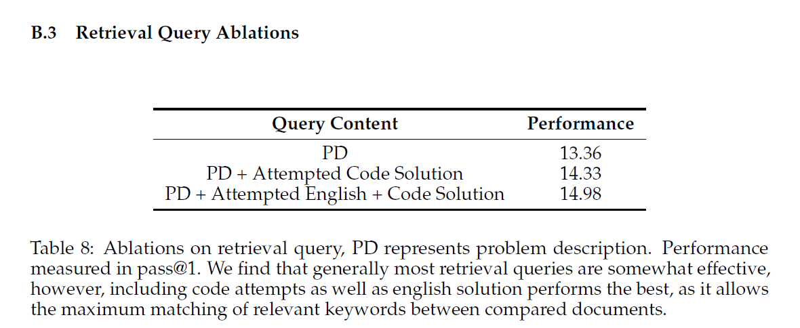

# Description of result
## Dataset
- introduce [USACO](https://usaco.org) (USA computing olympiad) benchmark of 307 probs + unit tests (0-2 sample, 10-17 hidden) + ref soln + official analyses
	- setting: model cannot get hidden test input/output, **but can receive information on how many tests a given solution has passed.**
- competitive programming textbook data

## Eval
- "However, all methods are still far from solving the benchmark above bronze level, the easiest difficulty tier."
- smaller models struggle for silver and above, larger models struggle for gold and above. platinum remains unsolved
- other than CodeLlamma, no model errs are mainly due to compile err (i.e. they get the syntax right and the main errors come from algorithmic or 'understanding the real problem' type of errors)
### Zero shot
- GPT-4 only achieves a 8.7% pass@1 accuracy with zero-shot CoT

### Prompting + Memory

### "Episodic Retrieval works across model sizes, unlike Reflexion"
- "This is likely because self-reflection relies on the internal model’s strength to reason over sparse, binary reward signals. Retrieval, on the other hand, allows models to reference existing reasoning and code snippets, requiring less intrinsic model capabilities. Our findings thus corroborate Li et al. (2023a), where LMs can understand much more complex competitive programming solutions than they can produce."
### "Episodic Retrieval and Reflexion have strong synergy"
- Best combo is episodic (other olympiad probs) + reflexion, GPT-4 20.2%, over double of zero shot performance
- Semantic + episodic + reflexion is slightly worse than episodic + reflexion
	- "for GPT-4, 70.2% of newly solved problems (relative to zero-shot) with semantic retrieval are also newly solved by episodic retrieval." 
	- probably cos of longer context n things lost in middle without additional info gain (Liu et al., 2024). (i also observed this in other expts)
	- "In contrast, only 45.9% of newly solved problems with Reflexion overlap with episodic retrieval"
### "Performance gains are not due to memorization."
- eval on 36 problems after training cutoff; solve rate drops to 0 for all. "USACO questions are well known to increase in difficulty every year, making this likely an effect of difficulty increases, inclusion in pre-training data, as well as small sample size."

## Human in the loop study
- "small number of targeted hints enable GPT-4 to solve 13 out of 15 problems previously unsolvable by any model and method". 
	- gpt3.5 solves none
- 'conversational “tutoring” setup by pointing out errors and giving minimal hints'
	- 'human is not allowed to provide specific fixes rather only general instructions (e.g., “you are using the wrong algorithm” or “this code may result in index out of bounds”).'
- This indicates... 
	- the emergent potential of stronger LMs to incorporate high-quality feedback 
	- the need to develop new methods that can generate such human-level corrective feedback 
	- re-thinking of the right metric for measuring model capabilities beyond the overly strict execution success.
		- "one may be one correction away from a fully correct solution, whereas the other may fundamentally misunderstand the problem scenario"

---
# How it compares to previous work
- other benchmarks like HumanEval and MBPP 'effectively solved' with rates >90% 
	- (my note: actually MBPP dataset isnt that clean; MBPP+ as a benchmark is more reflective and I havent seen any works going into the 90% range for this yet)
- "previous explorations of competitive programming lack exhaustive unit test suites, lack problem analyses, or lack enough problem diversity to comprehensively evaluate algorithmic reasoning"
- "unlike previous program synthesis benchmarks, successful models must reason over ad hoc environments, creating novel algorithms tailored to each problem scenario"
- Official analyses + competitive programming textbook is sth i dont see usually in other data sets
- Additional reasoning beyond benchmarks like MBPP etc: 
	- other benchmarks usually frame the problem symbolically, while olympiad problems disguise the 'real problem' in a story which the solver must extract the real problem from
	- "At all levels ... unlike interview-level problems, rarely follow directly from well-known algorithms. "
	- "Gold and platinum problems may additionally require knowledge of known algorithms and data structures, often using them in unorthodox ways."

---
# Main strategies used to obtain results

## Prompting: Reflexion
- model first prompted to solve the problem by generating code and explanation
- For each iteration of reflection
	- model prompted to reflect on what went wrong previously
	- then fix the previous code, given the prev soln, execution output of prev soln,  contents of a buffer of past solve attempts. 
	- buffer details: accumulative history of previous buffer, current response (attempted soln), execution output, retrieval text, `retrieval_problem_ids`, problem description
- loop iterates until a set max $i = 3$ as they observe no empirical gains in solve rate past 3 rounds (Appendix B.5)

## Memories
"We note that when solving problems, humans tend to recall either task-specific, established algorithms, facts, and concepts about the domain, or past experiences and generalizations from solving previous, similar problems relative to the problem at hand. This represents semantic knowledge, and episodic knowledge respectively" reference to  CoALA (my summary [here](../../agi-potential-notes/papers/coala.md))
- Semantic: competitive programming textbook.
- Episodic: rest of the problems and solns (leave one out)

## Retrieval
- Ctx is problem desc + LM's first attempt in code
	- "This allows accurate retrieve relevant algorithm descriptions from the underlying retrieval corpus, as solely utilizing the problem descriptions does not allow retrieval over algorithmic keywords. ... do not count this initial generation as an attempt ... does not get evaluated by our local judge"
	- from below, its 1.5% improvement
	- tuning the num retrieved param: over 1-4, 2 works best, suggesting context len should preferrably be short
		- episodic: optimal to retrieve 2 entries for GPT4, 1 entry for GPT3.5
- BM25 for RAG (isit cos too much data?)
- as semantic can be quite long, the inputs are truncated

---

# Other

- ref soln occasionally originally not in Python 3 but translated by GPT-4 into Python 3 and cross-checked against hidden tests and constraints

## Qualitative analysis

### Example 1: Models can borrow reasoning about similar problem environments

### Example 2: Models can adopt existing code structure and algorithms
"With episodic retrieval, we see the model grounding itself in the
retrieved content, borrowing significant code structure and algorithmic reasoning of the
retrieved problem."

### Example 3: Models can utilize algorithmic concepts and reasoning from texts
- model fetches a textbook chapter on LCA instead of Dijkstra’s algorithm for shortest paths (algo utilized in the official problem analysis)
- Visual inspection of the Dijkstra’s chapter: short and light on details, so low retrieval score. 
- highlights the flexibility of the retrieval query to adapt to low quality documents, finding suitable replacements.

## Error analysis

