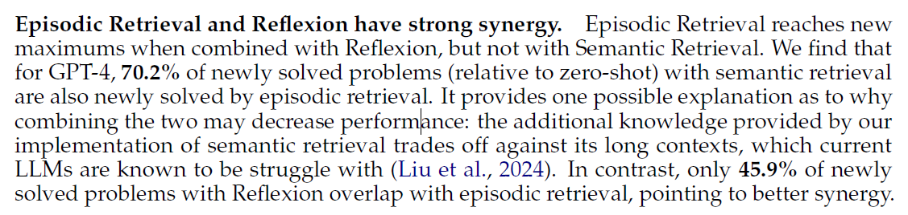

# Description of result
- introduce [USACO](https://usaco.org) (USA computing olympiad) benchmark of 307 probs + unit tests (0-2 sample, 10-17 hidden) + ref soln + official analyses
	- setting: model cannot get hidden test input/output, **but can receive information on how many tests a given solution has passed.**
- competitive programming textbook data
- GPT-4 only achieves a 8.7% pass@1 accuracy with zero-shot CoT
- Best combo is episodic (other olympiad probs) + reflexion, GPT-4 20.2%, over double of zero shot performance
	- "However, all methods are still far from solving the benchmark above bronze level, the easiest difficulty tier."
- human in the loop study
	- "small number of targeted hints enable GPT-4 to solve 13 out of 15 problems previously unsolvable by any model and method". 
	- gpt3.5 solves none
	- 'conversational “tutoring” setup by pointing out errors and giving minimal hints'
	- This indicates... 
		- the emergent potential of stronger LMs to incorporate high-quality feedback 
		- the need to develop new methods that can generate such human-level corrective feedback 
		- re-thinking of the right metric for measuring model capabilities beyond the overly strict execution success.

---
# How it compares to previous work
- other benchmarks like HumanEval and MBPP 'effectively solved' with rates >90% 
	- (my note: actually MBPP dataset isnt that clean; MBPP+ as a benchmark is more reflective and I havent seen any works going into the 90% range for this yet)
- "previous explorations of competitive programming lack exhaustive unit test suites, lack problem analyses, or lack enough problem diversity to comprehensively evaluate algorithmic reasoning"
- "unlike previous program synthesis benchmarks, successful models must reason over ad hoc environments, creating novel algorithms tailored to each problem scenario"
- Official analyses + competitive programming textbook is sth i dont see usually in other data sets
- Additional reasoning beyond benchmarks like MBPP etc: 
	- other benchmarks usually frame the problem symbolically, while olympiad problems disguise the 'real problem' in a story which the solver must extract the real problem from
	- "At all levels ... unlike interview-level problems, rarely follow directly from well-known algorithms. "
	- "Gold and platinum problems may additionally require knowledge of known algorithms and data structures, often using them in unorthodox ways."

- smaller models struggle for silver and above, larger models struggle for gold and above
- other than CodeLlamma, no model errs are mainly due to compile err (i.e. they get the syntax right and the main errors come from algorithmic or 'understanding the real problem' type of errors)
- eval on 36 problems after training cutoff; solve rate drops to 0 for all. "USACO questions are well known to increase in difficulty every year, making this likely an effect of difficulty increases, inclusion in pre-training data, as well as small sample size."

---
# Main strategies used to obtain results
## Memories
- Semantic: programming textbook
- Episodic: rest of the problems (leave one out)

- Semantic + episodic + reflexion is slightly worse than episodic + reflexion
	- probably cos of longer context n things lost in middle (i also observed this in other expt)
## Retrieval
- Ctx is problem desc + LM's first attempt in code
	- from below, its 1.5% improvement
	- tuning the num retrieved param: over 1-4, 2 works best, suggesting context len should preferrably be short
- BM25 for RAG (isit cos too much data?)

---

# Other
- "This is likely because self-reflection relies on the internal model’s strength to reason over sparse, binary reward signals. Retrieval, on the other hand, allows models to reference existing reasoning and code snippets, requiring less intrinsic model capabilities. Our findings thus corroborate Li et al. (2023a), where LMs can understand much more complex competitive programming solutions than they can produce."
- ref soln occasionally originally not in Python 3 but translated by GPT-4 into Python 3 and cross-checked against hidden tests and constraints